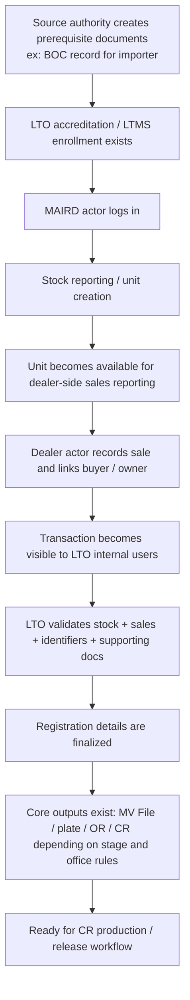

# 01. Portal Workflow Map

[Home](README.md) | [MAIRD Actor](02-maird-actor-workflow.md) | [Dealer Actor](03-dealer-actor-workflow.md) | [LTO Internal Actor](04-lto-internal-actor-workflow.md) | [Field Matrix](05-field-dependency-matrix.md) | [Page Inventory](06-page-inventory-by-actor.md)

---

## Goal

Map the **actor-only portal workflow** from the start of a brand-new unit being introduced into the LTO ecosystem up to LTO internal completion of registration data and CR readiness.

## Actor chain

1. **BOC / source authority** (document origin, not a normal portal operator)
2. **MAIRD actor** — manufacturer / assembler / importer / rebuilder
3. **Dealer actor**
4. **LTO internal actor**

## End-to-end logic

## Swimlane view

```mermaid
flowchart LR
    subgraph S1[Source Authority]
        A1[BOC / external source document issued]
    end
    subgraph S2[MAIRD Actor]
        B1[Maintain accreditation]
        B2[Encode unit master data]
        B3[Submit stock report]
    end
    subgraph S3[Dealer Actor]
        C1[Select stock-reported unit]
        C2[Encode sale details]
        C3[Associate buyer / owner]
        C4[Submit sales report]
    end
    subgraph S4[LTO Internal Actor]
        D1[Review stock and sales records]
        D2[Validate identifiers and requirements]
        D3[Assess / finalize registration]
        D4[Generate or confirm registration outputs]
    end

    A1 --> B1 --> B2 --> B3 --> C1 --> C2 --> C3 --> C4 --> D1 --> D2 --> D3 --> D4
```

## What each actor controls

| Actor | Controls | Cannot finalize |
|---|---|---|
| MAIRD actor | accreditation readiness, stock reporting, master unit data, initial identifiers | dealer sale, final registration approval, CR release |
| Dealer actor | sales reporting, buyer association, sales-side supporting data | stock creation, final LTO approval, CR issuance |
| LTO internal actor | compliance review, approval, registration finalization, registration outputs | upstream external source document creation |
| BOC / source authority | origin of importer documentary basis | LTO portal registration processing |

## High-risk handoff points

### Handoff A — source document to MAIRD
Typical example for importer:
- BOC-origin registration / import document exists
- importer accreditation requirement is complete
- importer user account is active

### Handoff B — MAIRD to dealer
Dealer can only proceed if the unit is already:
- stock-reported
- uniquely identified
- available in dealer search / selection

### Handoff C — dealer to LTO
LTO internal users need at minimum:
- valid stock record
- valid sales record
- vehicle identifiers
- owner / buyer link
- required documentary basis

### Handoff D — LTO to CR production
CR production readiness depends on the registration record being complete enough for internal production rules, including the availability or finalization of generated identifiers and document numbers.
