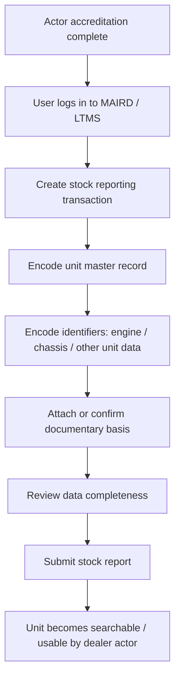
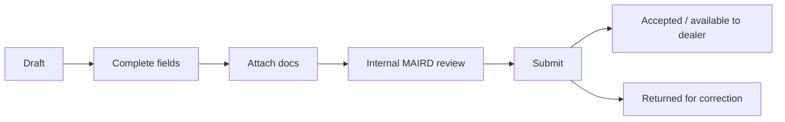

# 02. MAIRD Actor Workflow

[Home](README.md) | [Workflow Map](01-portal-workflow-map.md) | [Dealer Actor](03-dealer-actor-workflow.md) | [LTO Internal Actor](04-lto-internal-actor-workflow.md) | [Field Matrix](05-field-dependency-matrix.md) | [Page Inventory](06-page-inventory-by-actor.md)

---

## Actor covered

- Manufacturer
- Assembler
- Importer
- Rebuilder

This page focuses on what this actor does **inside or for the portal workflow** before dealer sales reporting starts.

## Portal purpose for this actor

The MAIRD actor is responsible for making a **brand-new unit exist correctly in the LTO ecosystem** so it can move to the dealer and registration workflow.

## Primary responsibilities

1. Maintain accreditation and active portal access
2. Prepare source and compliance documents required for this actor type
3. Encode stock / inventory / unit master data
4. Encode unique vehicle identifiers
5. Submit stock reporting transaction
6. Make the unit available downstream for dealer action

## Upstream documentary origin

### Importer-specific start point

For importer flows, a key documentary dependency originates from the **Bureau of Customs (BOC)**. In official LTO materials, importer accreditation requires a **Certificate of Registration from the BOC**.

## End-to-end MAIRD sequence

## Suggested portal pages for this actor

### 1. Accreditation & Entity Profile
Shows:
- MAIRD company details
- accreditation status
- branch / facility info
- allowed user accounts
- actor type: manufacturer / importer / assembler / rebuilder

### 2. Stock Reporting Dashboard
Shows:
- draft stock reports
- submitted stock reports
- approved / returned items
- units pending completion

### 3. Unit Master Data Entry
Main fields typically needed:
- make
- model
- variant
- year model
- body type
- fuel type
- transmission type
- color
- gross weight / displacement / capacity if applicable
- source type: manufactured / assembled / imported / rebuilt

### 4. Vehicle Identifier Entry
Main fields:
- engine number
- chassis number / VIN
- conduction sticker data if applicable
- plant / assembly / import reference
- batch / lot / stock reference

### 5. Documentary Attachment / Confirmation
Typical documentary slots:
- accreditation-related basis
- product / specification basis
- source proof for importer / assembler / rebuilder type
- BOC-origin document for importers
- other LTO-required supporting documents

### 6. Submission Review Page
Checks:
- duplicate identifier detection
- missing fields
- missing attachments
- invalid formatting
- branch / entity mismatch

## Important fields by actor type

### Common minimum fields
- MAIRD entity ID / business ID
- branch / facility
- unit type
- make
- model
- year model
- engine number
- chassis number / VIN
- stock reference number
- source transaction / intake date

### Importer-heavy fields
- BOC document reference number
- BOC registration / payment / clearance reference as applicable
- import entry or shipment reference
- arrival / release date

### Manufacturer / assembler-heavy fields
- production batch / line reference
- plant / assembly site
- conformity / model approval references where required

### Rebuilder-heavy fields
- rebuilt unit reference
- source unit linkage
- rebuild center references where required

## Attachments / documentary basis

> Use these as portal design slots. Exact document names may vary by actor type and latest LTO implementation.

### Common
- certificate of accreditation or active accreditation record
- company profile / authority documents where required
- authorized representative basis

### Importer
- BOC Certificate of Registration
- other BOC-issued or import-related document references required by LTO

### Manufacturer / assembler / rebuilder
- production or assembly basis
- conformity or technical basis
- internal stock / inventory basis if required by LTO

## Submission controls

## What this actor does **not** do

- does not record the retail sale to buyer
- does not finalize registration approval
- does not issue CR / OR
- does not assign final plate as LTO registration output

## Downstream handoff to dealer

The MAIRD actor hands off a unit that is:
- uniquely identified
- stock-reported
- searchable by dealer
- tied to the correct entity / branch
- supported by the necessary source documents
