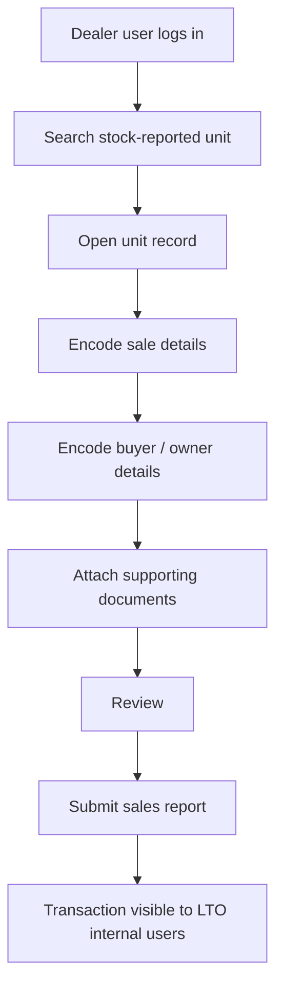
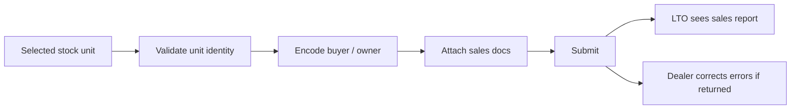

# 03. Dealer Actor Workflow

[Home](README.md) | [Workflow Map](01-portal-workflow-map.md) | [MAIRD Actor](02-maird-actor-workflow.md) | [LTO Internal Actor](04-lto-internal-actor-workflow.md) | [Field Matrix](05-field-dependency-matrix.md) | [Page Inventory](06-page-inventory-by-actor.md)

---

## Actor covered

- Dealer portal user
- Dealer branch user
- Authorized dealer representative

## Portal purpose for this actor

The dealer actor takes a **stock-reported unit** and records the **sale-side transaction** that connects the unit to the buyer / owner information before LTO internal registration processing.

## Core responsibilities

1. Search and select a stock-reported unit
2. Encode sale details
3. Encode buyer / owner details
4. Attach dealer-side documentary basis
5. Submit sales reporting transaction
6. Monitor whether LTO receives / accepts the sales record

## Main logic

## Suggested portal pages for this actor

### 1. Dealer Dashboard
Shows:
- pending sale encodings
- draft sales reports
- submitted sales reports
- returned / corrected sales reports
- units waiting for stock availability

### 2. Stock Unit Search & Selection
Main search keys:
- chassis number / VIN
- engine number
- stock reference number
- conduction sticker number if used
- model / batch filters

### 3. Sales Report Entry
Main fields:
- sales invoice number
- sales date
- dealer branch
- unit price or transaction reference if needed internally
- transaction type

### 4. Buyer / Owner Information Entry
Even if the buyer does not access the portal, the dealer still records these details.

Typical fields:
- full name / registered owner name
- address
- contact number
- email address
- tax / ID / client reference if required
- representative information if the buyer uses one

### 5. Document Attachment Page
Typical attachments or document slots:
- sales invoice
- authority letter / authorization if representative is acting
- valid ID basis
- proof of ownership / transfer basis as required in the transaction

### 6. Submission & Status Page
Status concepts:
- draft
- submitted
- received by LTO
- returned for correction
- accepted for evaluation

## Key control rule

Dealer action depends on the stock record already existing. The dealer should **not create the unit from scratch**. The dealer selects a unit that was already introduced upstream by the MAIRD actor.

## Dealer-side critical fields

### Required unit link fields
- stock record ID
- engine number
- chassis number / VIN
- make / model / variant
- source MAIRD entity / branch

### Required sale fields
- sales invoice number
- sales date
- dealer branch / office
- submitting user

### Required buyer / owner fields
- owner name
- address
- contact details
- representative / authorization basis when applicable

## Controls and validations

## What this actor does **not** do

- does not perform original stock reporting for the unit
- does not create final LTO registration approval
- does not generate final CR / OR
- does not own final registration numbering logic

## Handoff to LTO internal users

When dealer submission is complete, LTO internal users should be able to see:
- the stock-backed vehicle record
- the sale record
- the buyer / owner association
- supporting dealer-side documents
- enough data to begin registration-side review
