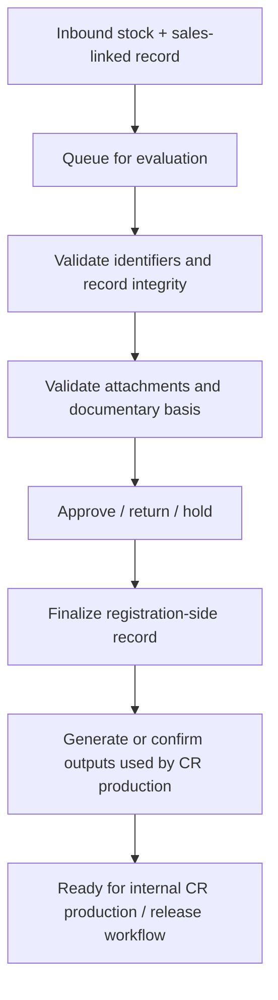
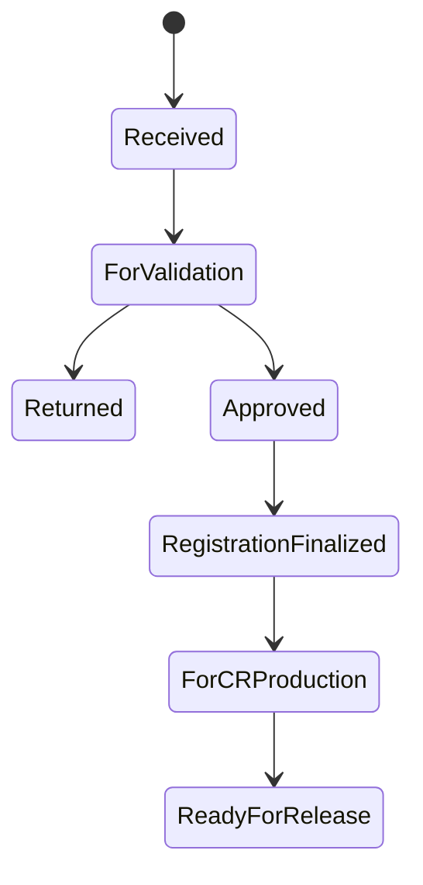

# 04. LTO Internal Actor Workflow

[Home](README.md) | [Workflow Map](01-portal-workflow-map.md) | [MAIRD Actor](02-maird-actor-workflow.md) | [Dealer Actor](03-dealer-actor-workflow.md) | [Field Matrix](05-field-dependency-matrix.md) | [Page Inventory](06-page-inventory-by-actor.md)

---

## Actor covered

- LTO evaluator / processor
- registration officer
- approval user / supervisor
- internal CR production control user

## Portal purpose for this actor

LTO internal users receive the upstream MAIRD and dealer records, validate them, and finalize the registration-side outputs needed for CR production and release.

## Core responsibilities

1. Receive stock + sales + owner-linked transaction
2. Validate identifiers and documentary basis
3. Resolve exceptions / return for correction if needed
4. Finalize registration-side record
5. Generate or confirm key outputs used by CR production
6. Maintain auditability and status control

## Main LTO internal logic

## Suggested portal pages for this actor

### 1. Intake Queue
Shows:
- newly submitted units
- source entity / branch
- dealer branch
- pending validation reason
- age of pending transaction

### 2. Record Validation Page
Checks:
- stock record exists
- sales record exists
- engine number and chassis number consistency
- duplicate unit prevention
- actor / branch consistency

### 3. Requirement Review Page
Checks:
- accreditation validity of upstream actor when relevant
- required attachments present
- importer documentary basis if importer route
- sales-side documentary basis present
- no obvious mismatch in names / references / identifiers

### 4. Exception Resolution Page
Actions:
- return to MAIRD actor
- return to dealer actor
- mark as on hold
- escalate to supervisor
- request re-upload or correction

### 5. Registration Finalization Page
Internal outputs may include:
- transaction acceptance
- registration-side record creation / finalization
- **MV File Number** if generated at this stage in the LTO workflow
- plate assignment state
- OR / CR generation state

### 6. CR Production Readiness Page
Used to determine whether the unit can proceed to production workflow.

Checks:
- all required vehicle identity fields present
- registration record complete
- generated numbers available where needed
- no blocking exception

## Important generated / controlled fields

### Fields that are usually **carried in** from upstream
- engine number
- chassis number / VIN
- make / model / variant
- source entity and dealer linkage
- buyer / owner data
- invoice and sale references

### Fields that are typically **owned or finalized by LTO internal processing**
- MV File Number or registration record identifier
- plate number assignment state or final plate number
- OR number / official receipt status
- CR number / registration document record
- registration status
- release readiness status

## Registration-state checkpoints

## What this actor controls

- truth of registration-side workflow status
- return / correction routing
- generated-number visibility
- final readiness for CR production

## What this actor does **not** do

- does not originate the importer’s BOC documents
- does not create the dealer sale itself
- should not overwrite core upstream facts without traceability
