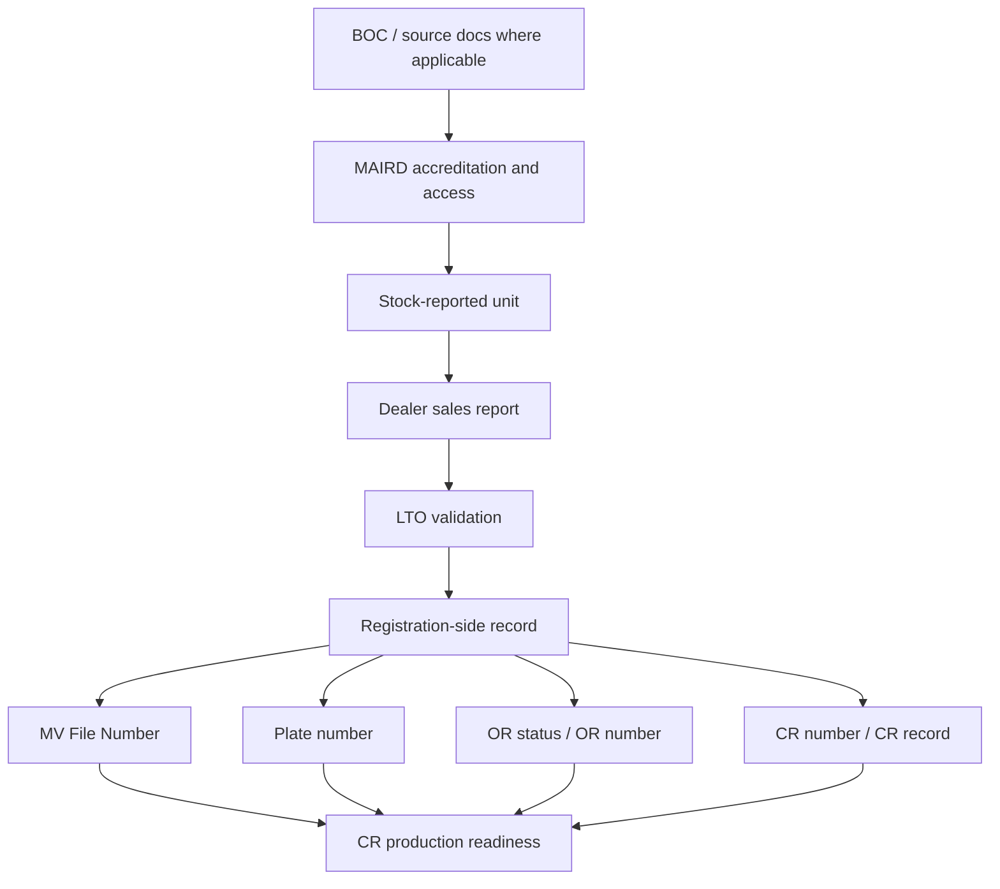

# 05. Field, Dependency, Attachment, and Status Matrix

[Home](README.md) | [Workflow Map](01-portal-workflow-map.md) | [MAIRD Actor](02-maird-actor-workflow.md) | [Dealer Actor](03-dealer-actor-workflow.md) | [LTO Internal Actor](04-lto-internal-actor-workflow.md) | [Page Inventory](06-page-inventory-by-actor.md)

---

## How to read this page

This matrix is meant for system design. It tells you:
- **who creates the data**
- **who edits or validates it**
- **what stage it appears**
- **what depends on it**

## Core field ownership matrix

| Field / Data Point | Primary source actor | Stage first appears | Downstream used by | Notes |
|---|---|---|---|---|
| MAIRD entity / branch | MAIRD actor | accreditation / profile | dealer, LTO | entity ownership context |
| Dealer entity / branch | Dealer actor | sales reporting | LTO | identifies selling branch |
| Unit type / category | MAIRD actor | stock reporting | dealer, LTO | affects validation rules |
| Make / model / variant | MAIRD actor | stock reporting | dealer, LTO | should not diverge downstream |
| Year model | MAIRD actor | stock reporting | dealer, LTO | upstream master data |
| Engine number | MAIRD actor | stock reporting | dealer, LTO | critical identifier |
| Chassis number / VIN | MAIRD actor | stock reporting | dealer, LTO | critical identifier |
| Conduction sticker series / number | MAIRD actor / LTO rule context | stock reporting / related step | dealer, LTO | only where applicable |
| Stock reference number | MAIRD actor | stock reporting | dealer, LTO | links unit to stock event |
| BOC reference / certificate basis | importer route | accreditation / stock prep | LTO | importer-specific basis |
| Sales invoice number | Dealer actor | sales reporting | LTO | sale-side required reference |
| Sales date | Dealer actor | sales reporting | LTO | part of transaction chronology |
| Buyer / owner name | Dealer actor | sales reporting | LTO | buyer does not access portal in this scope |
| Buyer / owner address | Dealer actor | sales reporting | LTO | owner profile basis |
| Buyer / owner contact details | Dealer actor | sales reporting | LTO | communication / record support |
| Representative / authorization info | Dealer actor | sales reporting | LTO | if someone acts for owner |
| Registration record ID | LTO internal actor | evaluation / finalization | internal downstream | system-owned transaction record |
| MV File Number | LTO internal actor | registration finalization | CR production / release | critical registration identifier |
| Plate number | LTO internal actor | registration finalization | CR production / release | may be assigned or confirmed at internal stage |
| OR number / status | LTO internal actor | registration / payment completion | CR production / release | official receipt linkage |
| CR number / record | LTO internal actor | registration document generation | CR production / release | core output |
| Release readiness status | LTO internal actor | post-finalization | production / releasing | controls downstream release |

## Attachment matrix

| Attachment / Documentary Basis | Supplied by | Main use |
|---|---|---|
| Accreditation basis / entity legitimacy docs | MAIRD actor | prove authority to transact |
| BOC Certificate of Registration | Importer route | importer documentary basis |
| Other import-related BOC references | Importer route | source validation |
| Production / assembly / rebuild basis | MAIRD actor | actor-type specific documentary support |
| Sales invoice | Dealer actor | prove sale-side record |
| Authorization / representative basis | Dealer actor | when acting for owner |
| Valid ID basis / supporting owner docs | Dealer actor | owner identity / authority support |

## Status ownership matrix

| Status | Owned by | Meaning |
|---|---|---|
| Draft | MAIRD / Dealer | not yet submitted |
| Submitted | MAIRD / Dealer | sent to next stage |
| Available for Dealer | system / MAIRD handoff | unit ready for sales reporting |
| Received by LTO | LTO internal intake | visible to internal queue |
| For Validation | LTO internal | under review |
| Returned for Correction | LTO internal | upstream actor must fix issue |
| Approved | LTO internal | cleared to proceed |
| Registration Finalized | LTO internal | registration-side outputs are in place |
| For CR Production | LTO internal | internal production can proceed |
| Ready for Release | LTO internal | release controls satisfied |

## Dependency tree for key outputs

## Portal design rule

Do not let downstream users manually retype critical upstream identifiers unless the action is explicitly controlled, traceable, and justified by exception handling.
