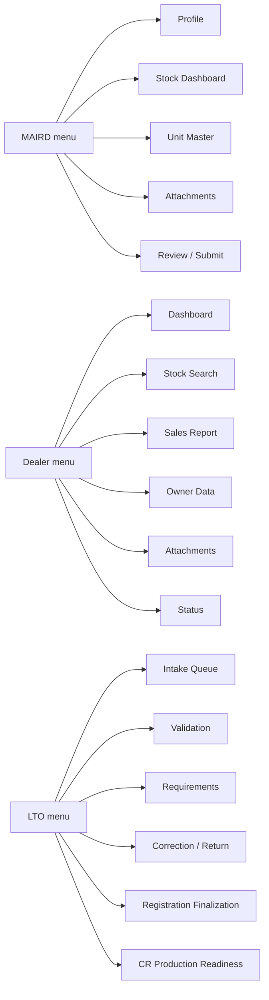

# 06. Portal Page Inventory by Actor

[Home](README.md) | [Workflow Map](01-portal-workflow-map.md) | [MAIRD Actor](02-maird-actor-workflow.md) | [Dealer Actor](03-dealer-actor-workflow.md) | [LTO Internal Actor](04-lto-internal-actor-workflow.md) | [Field Matrix](05-field-dependency-matrix.md)

---

## Purpose

Translate the process into **actual portal sections/pages** your team can design.

## MAIRD actor pages

### A. Entity Profile & Accreditation
What it shows:
- company / branch details
- accreditation status
- actor type
- allowed users

Actions:
- view profile
- update limited profile fields
- manage authorized users

### B. Stock Reporting Dashboard
What it shows:
- drafts
- submitted stock reports
- returned records
- accepted records

Actions:
- create new stock report
- continue draft
- view submission history

### C. Unit Master Form
What it shows / captures:
- make / model / variant
- year model
- body / fuel / transmission data
- identifiers
- stock source details

### D. Attachment Manager
What it shows:
- required documentary slots by actor type
- uploaded files
- validation remarks

### E. Submission Review & Audit Trail
What it shows:
- all encoded fields
- submit / resubmit action
- error messages
- submission history

## Dealer actor pages

### A. Dealer Dashboard
What it shows:
- stock-available units
- drafts
- returned sales reports
- recently submitted reports

### B. Stock Unit Search
Search by:
- VIN / chassis
- engine number
- stock reference
- model

### C. Sales Report Form
Captures:
- sales invoice info
- sales date
- dealer branch
- transaction notes

### D. Buyer / Owner Data Form
Captures:
- owner name
- address
- contact details
- representative details where applicable

### E. Dealer Attachment Page
Captures:
- sales invoice
- authorization documents
- owner support docs

### F. Submission & Status Page
Shows:
- submitted timestamp
- LTO receipt state
- return remarks
- correction actions

## LTO internal pages

### A. Intake Queue
Shows:
- inbound records
- actor source
- aging / SLA view
- exception flags

### B. Record Validation Page
Shows:
- stock vs sales consistency
- identifier checks
- duplicate or mismatch warnings

### C. Requirement Review Page
Shows:
- attachments checklist
- actor-specific documentary basis
- importer route documentary validation

### D. Correction / Return Page
Actions:
- return to MAIRD
- return to dealer
- add remarks
- escalate

### E. Registration Finalization Page
Shows / controls:
- registration-side record summary
- MV File Number state
- plate assignment state
- OR / CR state

### F. CR Production Readiness Page
Shows:
- whether all required fields exist
- blocking conditions
- production queue eligibility

## Cross-cutting pages

### Audit Trail
Needed for all actors:
- who edited what
- when submitted
- when returned
- who approved / finalized

### Notifications / Alerts
Needed for all actors:
- missing fields
- returned transactions
- approval / acceptance
- readiness for next stage

## Suggested actor navigation map

