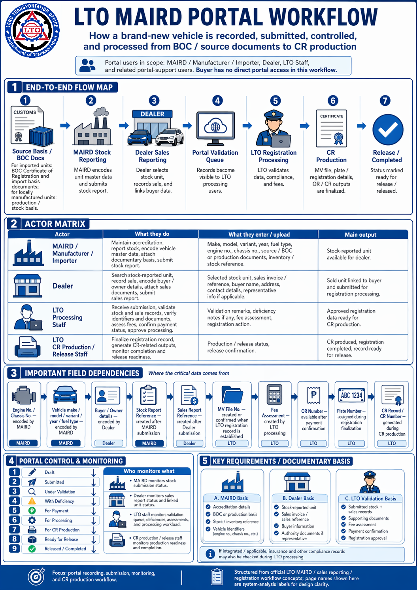

# LTO MAIRD Portal

This pack focuses only on the **portal-facing actor workflow** for **brand-new vehicle recording, stock reporting, sales reporting, and registration handoff** inside the LTO / LTMS / MAIRD process.

## Scope

Included:
- Manufacturer / Assembler / Importer / Rebuilder portal responsibilities
- Dealer portal responsibilities
- LTO internal portal responsibilities
- Upstream dependencies such as **BOC-origin documents for importers**
- Core fields, attachments, status checkpoints, and handoff rules
- Linked markdown navigation and Mermaid diagrams

Excluded:
- Buyer-facing portal flow
- Insurance / emission deep dive
- Full public renewal workflow

## Start here

1. [Portal Workflow Map](01-portal-workflow-map.md)
2. [MAIRD Actor — Manufacturer / Importer / Assembler / Rebuilder](02-maird-actor-workflow.md)
3. [Dealer Actor — Sales Reporting Workflow](03-dealer-actor-workflow.md)
4. [LTO Internal Actor — Evaluation, Registration, CR Control](04-lto-internal-actor-workflow.md)
5. [Field, Dependency, Attachment, and Status Matrix](05-field-dependency-matrix.md)
6. [Portal Page Inventory by Actor](06-page-inventory-by-actor.md)

## Quick actor view

## Important note

Some exact internal LTMS page titles are not publicly exposed in official LTO materials. In this pack, **page names are system-analysis labels** so your team can design the portal cleanly while keeping the workflow aligned with the official LTO process basis.
